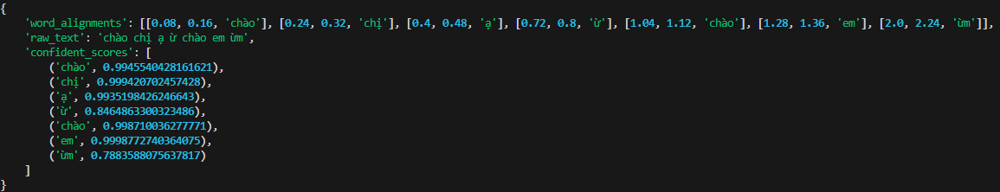

# Infer Fast-conformer ASR tutorial 
## Infer with LM + get Force Alignment + get Confidence
### Introduce 

This folder will help you implement ASR inference using the FastConformer model. To run inference, set the "NEMO_PATH", "KENLM_PATH", and "ASR_DEVICE" variables in the ``.env`` file. You can find an example in the ``.env.example`` file.

For instructions on obtaining a .nemo model or KenLM model, please refer to the [FastConformer directory].(../Fastconformer)
* Feature: The output will return three fields: ``raw_text``, ``word_alignments``, and ``confidence_score``.

### Infer
B1: cd into "Fastconformer/infer_N" 

B2: Infer
- Fill wav_test varible 
- Run python "inferFULL_get_confidence_force_LM.py" file

Ouput describe:

That is dict:
    