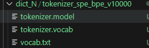
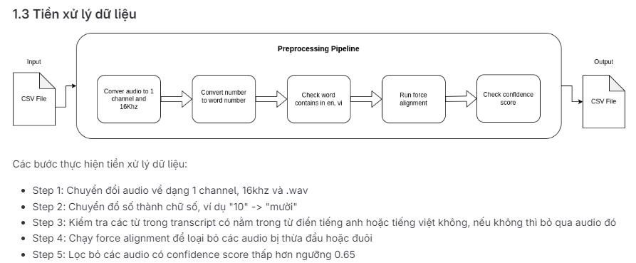

# How to using pretrain fast conformer ASR model for finetune task?
## Install library
 - ``cd Fast-conformerASR-NVIDIA``  
 - run in command ``pip install nemo_toolkit['all']`` to install Nemo framework
## Create 2 folder metadata_tokenizer and metadata_train
### metadata_tokenizer
- metadata_tokenizer for task creat vocab and tokenizer object
- metadata_tokenizer contains json file (all infor from text - transcript after coressponding preprocess)
- ex: 
```
các bác sĩ có thể chăm sóc người bệnh
em bây giờ mới là hiện tại của anh ấy
thôi anh đừng nói gì nữa tôi chưa đủ khổ
trước ăn thì không sao nhưng mà tối nay
những cái lý thuyết của riêng mình về
sau hơn một vạn tấn lương thực viện trợ
xin kính chào quý vị khán giả và các bạn
nơi đây và em thích con người ở đây em
không thể nào mở lòng với ai hai năm qua
    .   .   .   .   .   .   .   .
```
### metadata_train
- metadata_train contains testcv.json and traincv.json, this is mainfest file to put inside config file train. 
- ex:
```
{"audio_filepath": "/home/pdnguyen/VietAIbud500/Bud500_convert/valid/wavs/5.wav", "duration": 2.4624375, "text": "dù ai trước ai sau người không được yêu"}
{"audio_filepath": "/home/pdnguyen/VietAIbud500/Bud500_convert/valid/wavs/6.wav", "duration": 2.9015, "text": "hoặc là một lời nói trực tiếp ở ngoài"}
{"audio_filepath": "/home/pdnguyen/VietAIbud500/Bud500_convert/valid/wavs/7.wav", "duration": 2.0811875, "text": "chẳng hạn nhưng rồi cuối cùng lại không"}
{"audio_filepath": "/home/pdnguyen/VietAIbud500/Bud500_convert/valid/wavs/8.wav", "duration": 1.561875, "text": "bây giờ thì mỗi lần mà quay quán nhậu"}
{"audio_filepath": "/home/pdnguyen/VietAIbud500/Bud500_convert/valid/wavs/9.wav", "duration": 2.121, "text": "lúc này quấn quýt như đôi chim sâu nên"}
```
## Prepare data and vocab, dict, tokenizer
- run code ``prepare_data.sh`` to prepare dictionary, vocab and tokenizer
````
python /home/pdnguyen/fast_confomer_finetun/Fast-conformerASR-NVIDIA/process_asr_text_tokenizer.py \
        --data_file="/home/pdnguyen/fast_confomer_finetun/Fast-conformerASR-NVIDIA/metadata_tokenizer/teranscrip_all.json" \
        --data_root="/home/pdnguyen/fast_confomer_finetun/Fast-conformerASR-NVIDIA/dict_N" \
        --vocab_size=10000 \
        --tokenizer="spe" \
        --no_lower_case \
        --spe_type="bpe" \
        --spe_character_coverage=1.0 \
        --log
````

- Before you want to train model you need preprocessing data fllowing steps: 


## Trainning
